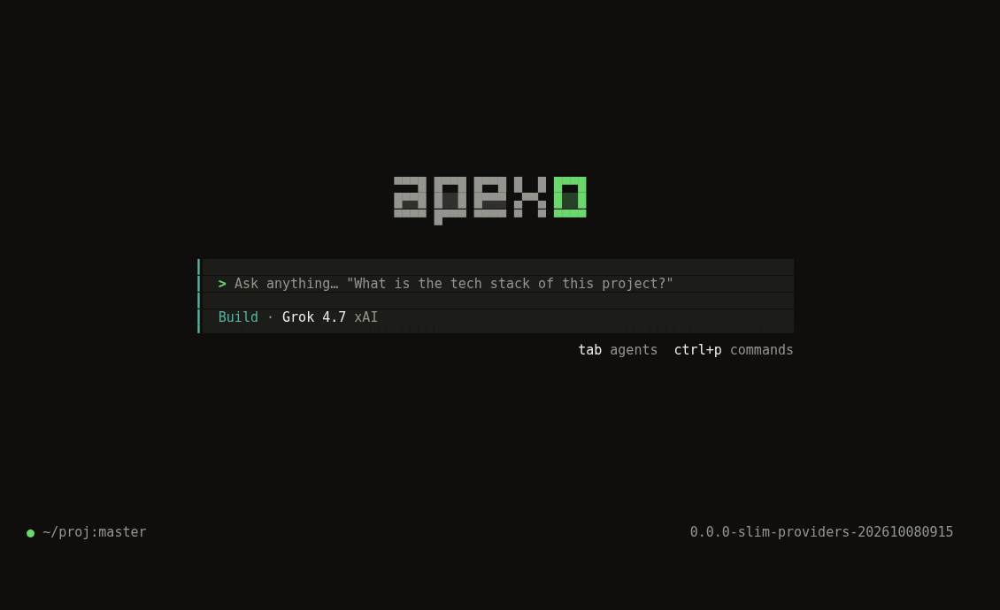
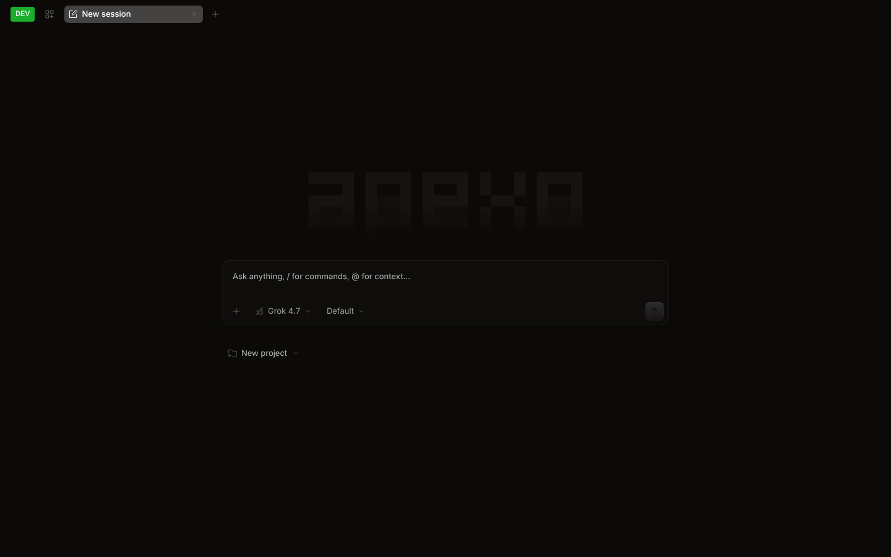

<p align="center">
  
</p>
<p align="center"><b>Grok 的 UI 外壳（UI harness）。</b>开源的编程智能体，支持终端、浏览器和桌面端。</p>
<p align="center">
  <a href="README.md">English</a> |
  <a href="README.zh.md">简体中文</a>
</p>

---

## Apexo 是什么？

Apexo 是 **Grok** 的 UI 外壳。它的核心目标是支持 SpaceXAI 官方开源编程智能体
[Grok Build](https://github.com/xai-org/grok-build)，让每个人都能更方便地使用 Grok。
终端界面（TUI）、Web 界面和桌面应用共用同一个本地智能体服务。

目前已经具备：

- **Grok 优先。**使用 xAI 账号登录（SuperGrok；X Premium 账号以 xAI 实际开放的 Grok
  权限为准），采用 xAI 的 OAuth 设备码流程，无需 API key；也可以使用 `XAI_API_KEY`。
  可用 models.dev 目录中的全部 Grok 模型，例如 `grok-4.7`、`grok-4.6`、`grok-4.20`
  和 `grok-build-0.1`。
- **次要提供商（API key 方式）：**OpenAI、Anthropic（Claude）、Google（Gemini）。
  不包含其他提供商或其他 OAuth 登录方式。
- **没有付费订阅，没有广告。**不再有托管模型网关、账号控制台、会话分享服务、升级推销或任何推广内容。
  一切在本地运行，直接连接你配置的提供商。
- **终端、Web、桌面三端**共用同一个本地服务和同一份会话历史。
- **Grove 主题：**TUI 和应用的默认主题，暖黑底配绿色强调色。原有主题全部保留。

> [!NOTE]
> **与 Grok Build 的集成现状：**Apexo 目前还不能驱动 Grok Build CLI。它现在用自带的智能体循环，
> 通过你的 Grok 登录或 API key 直接调用 xAI API。把 Grok Build 本身接到 Apexo 的界面后面是我们的目标：
> Grok Build 通过 `grok agent stdio` 提供 Agent Client Protocol（ACP）服务，而 Apexo 已经内置
> ACP SDK。在这项集成完成之前，请把 Apexo 当作一个 Grok 优先的 UI 和智能体，而不是 Grok Build 的前端。

<p align="center">
  
</p>
<p align="center">
  
</p>

## 安装（从源码构建）

Apexo 暂未发布到任何包管理器。构建前需要安装 [Bun](https://bun.sh) 1.3.x（仓库固定为 `bun@1.3.14`）和 git。

```bash
git clone https://github.com/cluster1900/apexo-grok.git apexo && cd apexo
bun install

# 为当前机器构建单个原生二进制（内嵌 Web UI）
bun run --cwd packages/opencode build --single

# 产物位于 packages/opencode/dist/opencode-<os>-<arch>/bin/apexo
# （旁边还有一个相同的 "opencode" 二进制，用于兼容）
install -m755 packages/opencode/dist/opencode-*/bin/apexo ~/.local/bin/apexo
apexo --version
```

不构建、直接从源码运行：

```bash
bun dev            # 等同于 bun run --cwd packages/opencode src/index.ts
bun dev --help
```

## 使用

```bash
apexo                     # 在当前目录启动终端界面
apexo auth login          # 登录：选择 xAI -> "SuperGrok Subscription"（OAuth）或填写 API key
apexo auth list           # 查看已配置的凭据
apexo models xai          # 列出 Grok 模型
apexo run "解释一下这个仓库"   # 一次性、非交互运行
apexo web                 # 启动本地服务并打开 Web 界面
apexo serve               # 无界面服务（供桌面端、编辑器、脚本使用）
apexo acp                 # 作为 ACP 智能体运行，供 Zed 等编辑器接入
```

在 TUI 中：`/connect` 打开提供商对话框，`/models` 切换模型，`/themes` 切换主题，`ctrl+p` 打开命令面板；
以 `!` 开头的输入会作为 shell 命令执行。

### 提供商

| 提供商 | 连接方式 | 环境变量 |
| --- | --- | --- |
| **xAI Grok**（主要） | `apexo auth login` -> xAI -> SuperGrok Subscription（设备码 OAuth），或 API key | `XAI_API_KEY` |
| OpenAI | API key | `OPENAI_API_KEY` |
| Anthropic（Claude） | API key | `ANTHROPIC_API_KEY` |
| Google（Gemini） | API key | `GOOGLE_GENERATIVE_AI_API_KEY` |

仍保留通用的 OpenAI 兼容“自定义提供商”入口，可接入自建服务。

### 桌面应用

Electron 桌面应用位于 `packages/desktop`：

```bash
bun run --cwd packages/desktop dev        # 开发模式
bun run --cwd packages/desktop build      # 生产构建（打包使用 electron-builder）
```

由于 Apexo 暂无发布源，自动更新已关闭。

## 配置

Apexo 读取 JSON/JSONC 配置文件。优先使用 Apexo 命名，同时继续读取 OpenCode 命名，旧配置无需修改：

| 项目 | Apexo | 兼容读取（旧） |
| --- | --- | --- |
| 全局配置目录 | `~/.config/apexo/`（`apexo.jsonc`） | `~/.config/opencode/`（`apexo/` 不存在且它存在时使用） |
| 数据 / 状态 / 缓存 | `~/.local/share/apexo`、`~/.local/state/apexo`、`~/.cache/apexo` | 对应的 `opencode` 目录 |
| 项目配置 | `apexo.json` / `apexo.jsonc` | `opencode.json` / `opencode.jsonc` |
| 项目目录 | `.apexo/`（agents、commands、plugins、themes、tools） | `.opencode/` |
| 环境变量 | `APEXO_*`（如 `APEXO_CONFIG`、`APEXO_CONFIG_CONTENT`） | `OPENCODE_*` |

同一目录下两者都存在时，`apexo.json` 优先于 `opencode.json`，`APEXO_*` 优先于 `OPENCODE_*`。
`apexo.json` 示例：

```jsonc
{
  "model": "xai/grok-4.7",
  "theme": "grove"
}
```

配置格式与上游 OpenCode 相同，可参考 [OpenCode 配置文档](https://github.com/anomalyco/opencode/blob/dev/packages/web/src/content/docs/config.mdx)。

## 主题

- **TUI：**默认主题为 `grove`。可用 `/themes` 切换，或在 `tui.json`（`~/.config/apexo/tui.json`）
  中设置 `"theme"`。自定义主题放在 `.apexo/themes/*.json` 或 `~/.config/apexo/themes/`。
- **Web / 桌面应用：**在 设置 -> 外观 中默认使用 Grove，原主题显示为 “Classic”。

## 开发

```bash
bun install
bun turbo typecheck --concurrency=3
(cd packages/core && bun test)
(cd packages/opencode && bun test)
(cd packages/tui && bun test)
```

内部包名（`@opencode-ai/*`）和源码目录（`packages/opencode`）刻意保留上游名称，方便日后合并上游更新。

## 反馈

问题和建议请提交到 [github.com/cluster1900/apexo-grok/issues](https://github.com/cluster1900/apexo-grok/issues)。

## 许可证

MIT，详见 [LICENSE](LICENSE)，原版权声明保持不变。

---

## 源自 OpenCode

Apexo 基于 [OpenCode](https://github.com/anomalyco/opencode)（MIT 许可证，Copyright (c) 2025 opencode）
修改而来，感谢 OpenCode 的作者和贡献者。Apexo 所做的主要改动：

- 删除除 xAI（SuperGrok）之外的所有 OAuth/订阅登录方式，包括 ChatGPT/Codex、GitHub Copilot、
  GitLab Duo 和 Poe 登录。
- 内置提供商只保留四个：xAI、OpenAI、Anthropic、Google。其中 OpenAI、Anthropic、Google 仅支持 API key。
- 删除 OpenCode Zen/Go、托管控制台和账号登录、官网和文档站、会话分享、统计、托管基础设施，
  以及所有付费、升级推销、推广和广告内容。
- 新增受 Qoder 启发的 “Grove” 暖黑/绿色主题，作为 TUI 和应用的默认主题，其他主题保留。
- 产品更名为 Apexo：新的字标和图标、`apexo` 命令，以及 `apexo.json`、`.apexo/`、`~/.config/apexo`
  和 `APEXO_*`，并保留 OpenCode 命名的兼容回退。
